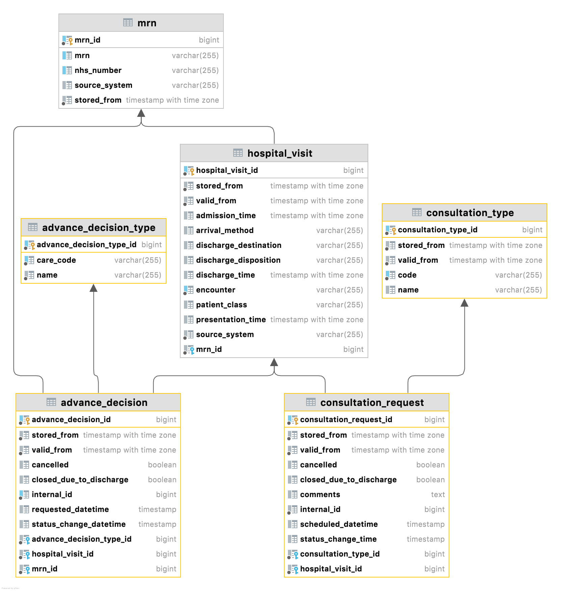

# EMAP Release

**Date: 2021-11-30 Changes in this release**

---

### Additional tables

- Consultation request: `consultation_request` & `consultation_type`
- DNACPR: `advanced_decision` & `advanced_decision_type`

#### Diagram:

#### [consultation_request](../data_dictionary/tables.md#ConsultationRequest)

**Attributes**

* consultation_request_id
* stored_from
* valid_from
* cancelled
* closed_due_to_discharge
* comments
* internal_id
* scheduled_datetime
* status_change_time
* consultation_type_id
* hospital_visit_id

#### [consultation_type](../data_dictionary/tables.md#ConsultationType)

**Attributes**

* consultation_type_id
* stored_from
* valid_from
* code
* name

#### [advanced_decision](../data_dictionary/tables.md#AdvanceDecision)

**Attributes**

* advance_decision_id
* stored_from
* valid_from
* cancelled
* closed_due_to_discharge
* internal_id
* requested_datetime
* status_change_datetime
* advance_decision_type_id
* hospital_visit_id
* mrn_id 

#### [advanced_decision_type](../data_dictionary/tables.md#AdvanceDecisionType)

**Attributes**

* advance_decision_type_id
* care_code
* name

### Changes/fixes

* Location metadata will be populated for locations that only have a department_id.
* Temporal columns in questions table are now stored with timezone information
* Patient Infections (patient_condition table) from hoover will now have the source system `clarity` instead of `hoover`

---
<!--
## Data sources

### Repository Versions

| Repository            | Version |
| :-                    | :-:     |
|Hl7-processor          | 2.3     |
|Emap_interchange       | 2.3     |
|Emap-Core              | 2.3     |
|Inform-DB              | 2.3     |
|Hoover                 | 2.3     |
>
