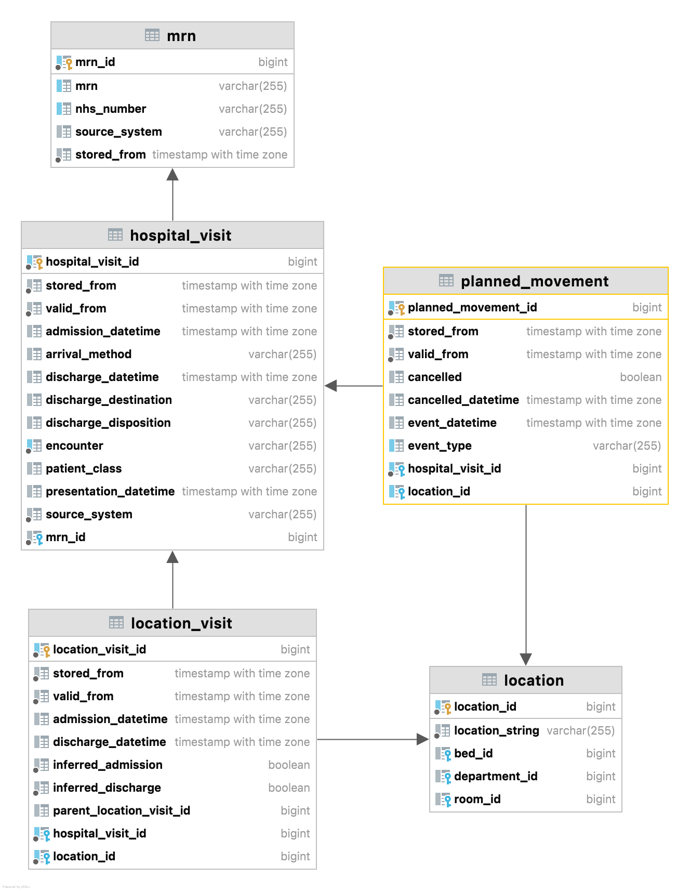

# EMAP Release

**Date: 2022-08-03**

---

### Tables added

#### PlannedMovement

Tracks the final history for each planned movement within the hospital.

| Name | Type | Description |
|---| --- |---|
| planned_movement_id | bigint | Unique identifier in EMAP for this PlannedMovement record. |
| hospital_visit_id | HospitalVisit | Identifier for the HospitalVisit associated with this record. |
| location_id | Location | Planned Location  to move to, may be null. |
| event_type | varchar(255) | The type of planned movement event (ADMIT, TRANSFER, DISCHARGE). |
| event_datetime | timestamp without timezone | The date and time that the planned movement event was made. |
| cancelled | boolean | Has the planned movement been cancelled (either by a user or because a different movement has occurred). |
| cancelled_datetime | timestamp without timezone | The date and time that the planned movement was cancelled. |

Diagram:

### Tables changed

Table           | Attributes added | Attributes removed | Renamed
:-- |:-- |:-- | --
patient_condition     | added_datetime | added_date_time | ✓
patient_condition     | resolution_datetime | resolution_date_time| ✓
consultation_request  | status_change_datetime | status_change_time | ✓
hospital_visit        | presentation_datetime | presentation_time | ✓
hospital_visit        | admission_datetime | admission_time | ✓
hospital_visit        | discharge_datetime | discharge_time | ✓
lab_test_definition   | name | | 
lab_result            | result_last_modified_datetime | result_last_modified_time | ✓
lab_sample            | receipt_at_lab_datetime | receipt_at_lab | ✓
lab_sample            | sample_collection_datetime | sample_collection_time | ✓
location_visit        | admission_datetime | admission_time | ✓
location_visit        | discharge_datetime | discharge_time | ✓
visit_observation_type | creation_datetime | creation_time | ✓

### Changes/fixes

- Modifies column names with a data type that includes a data and a time to have a _datetime suffix
- Lab test definitions and batteries now have human readable names
- `BIO_CONNECT` lab results lab_test_definition code has changed to match metadata from EPIC: `Glu` -> `2341-6`, `Ket` -> `53061-8`. Human readable `name` column in `lab_test_definition` makes these codes interpretable. 

---
<!--
## Data sources

### Repository Versions

| Repository            | Version |
| :-                    | :-:     |
|Hl7-processor          | 2.5     |
|Emap_interchange       | 2.5     |
|Emap-Core              | 2.5     |
|Inform-DB              | 2.5     |
|Hoover                 | 2.5     |
>
