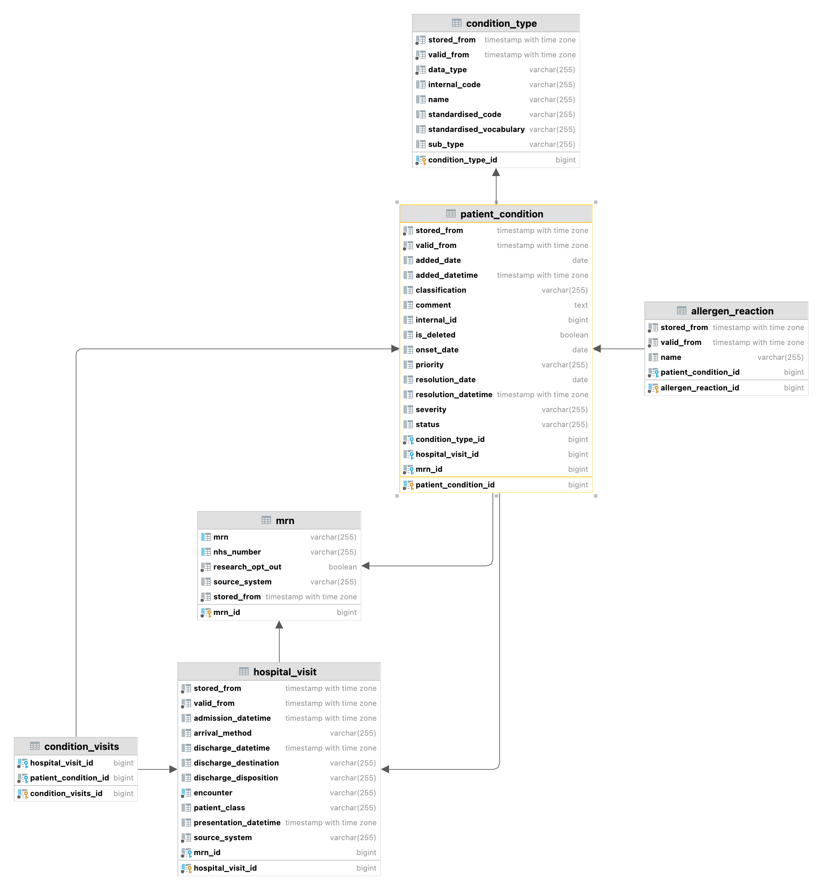

# EMAP Release

**Date: 2023-02-17**

---

### Tables added

#### AllergenReaction

Reactions to allergens that a patient can have so that it can be recognised by clinical staff.

| Name | Type | Description |
|---| --- |---|
| allergen_reaction_id | bigint | Unique identifier in EMAP for this **AllergenReaction** record. |
| patient_condition_id | bigint | Identifier for the PatientCondition associated with this record. |
| name | varchar(255) | Human readable name for this **AllergenReaction**. |

#### ConditionVisits

Linker table between the PatientCondition and HospitalVisit tables to efficiently model the many-many relationship
between the two.

| Name | Type | Description |
|---| --- |---|
| condition_visits_id | bigint | Unique identifier in EMAP for this condition visit record. |
| hospital_visit_id | bigint | Identifier for the HospitalVisit associated with this record. |
| patient_condition_id | bigint | Identifier for the PatientCondition associated with this record. |

### Tables changed

| Table                  | Attributes added      | Attributes removed |
|:-----------------------|:----------------------|:-------------------|
| advance_decision       |                       | mrn_id             |
| lab_battery            |                       | description        |
| patient_condition      | added_date            |                    |
| patient_condition      | resolution_date       |                    |
| patient_condition      | is_deleted            |                    |
| patient_condition      | severity              |                    |
| mrn                    | research_opt_out      |                    |
| visit_observation_type | has_visit_observation |                    |
| visit_observation_type | is_real_time          |                    |

### Changes/fixes

- NHS patient opt out from research is now available using the `research_opt_out` column
- Allergies now added
- Imaging reports from PACS now added
- Problem lists now added
- As each `advanced_decision` always has a hospital visit, removed unnecessary `mrn_id` column
- CoPath lab battery is now populated, rather than using `CO_PATH` for all results
- Remove unused `description` column from `lab_battery`
- Adds columns to patient_condition to accommodate problem lists
- You can now know if a visit observation type has any data (`has_visit_observation` column) and if it is being updated
  in real time (`is_real_time` column)

---
<!--

    ## Data sources
    
    - Allergies
    - PACS imaging reports. Results added
    - Problem lists

    ### Repository Versions
    
    | Repository            | Version |
    | :-                    | :-:     |
    |Hl7-processor          | 2.6     |
    |Emap_interchange       | 2.6     |
    |Emap-Core              | 2.6     |
    |Inform-DB              | 2.6     |
    |Hoover                 | 2.6     |

-->