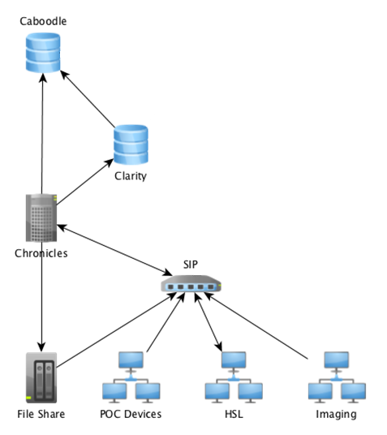
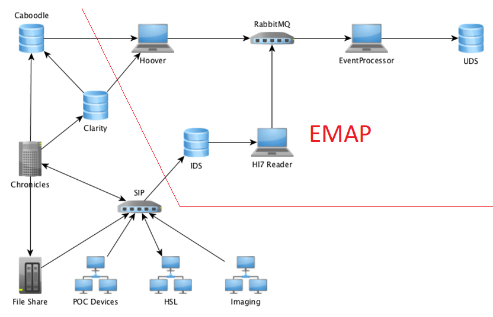
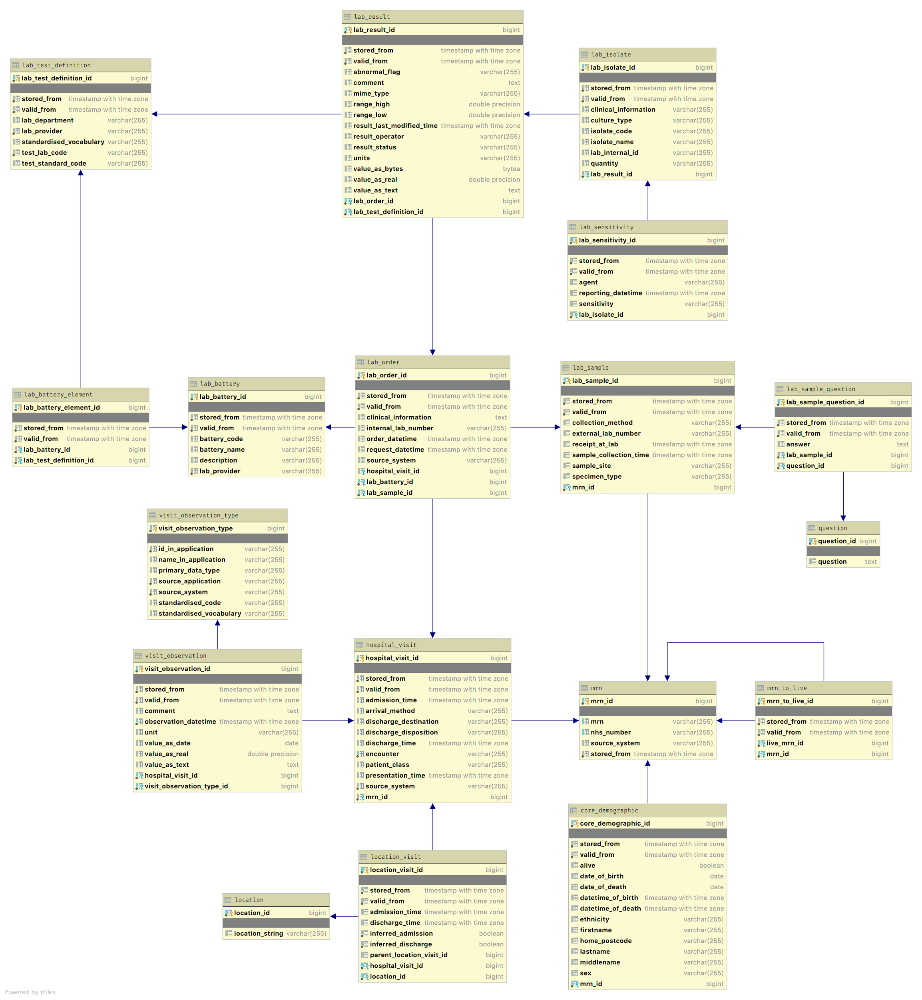

# Technical Overview EMAP

Note a Glossary of terms used is provided as a separate document.

## Introduction

Data and metadata are an integral part of any Hospital Trust’s electronic information systems. In hospital systems, data is 
recorded in a variety of locations depending on the needs of the staff. Data can also come 
in many forms, it may be plain text, images, PDFs or even waveform data. Metadata relates the data being recorded to 
internal mappings or external ontology records, as well provenance of the data. At UCLH, all data messages are recorded within the system but not in a 
systematic, formatted way that is easy to work with. Front end databases that are tailored to reporting 
(Caboodle/Clarity in Figure 1) are loaded with consolidated data during a nightly process of automated batch loads. 
While this data can be used for research, the nightly consolidation process means that the 
databases are always behind what is currently happening and may not exactly match events as they occurred, preventing 
any real-time application of the data. 

In order to provide live data suitable for research and clinical applications we have created the Experimental Medicine 
Application Platform (EMAP), an infrastructure that includes both the gathering of data in real-time and 
retrieving historical data. This functionality is not mirrored by any other accessible database within the Hospital 
Trust. 

The data delivered through EMAP is structured in such a fashion to be intuitive, with table and columns names 
reflecting data type as well as keeping consistency with other databases where possible. Data targeted by EMAP is data 
that has been specifically identified as useful to research groups requesting access. Providing these users with the 
relevant data outside of the hospital operational systems lowers the load on these systems. As a non-operational 
database it allows provision for long, slow queries such as complex queries trawling years of data, without risking 
impact on the hospital systems. The resulting database can be used, for example, by a researcher creating a predictive 
model of whether a patient presenting in ED is likely to be admitted to the main hospital, or by a technically inspired 
clinician to create an up-to-date view of derived metrics of each patient in a given ward. 

## EMAP Pipeline

Figure 2 illustrates how the EMAP pipeline integrates with the previously existing technical infrastructure for 
hospital data (as illustrated in Figure 1). It further highlights all individual components of the pipeline, which are 
further explained in the following. The components indicated by laptops in the figure represent the 'microservices' created to process and direct data within the pipeline.   

It is important to note here that the EMAP pipeline aims to record all the full history of events and not just the 
'status quo' at one point in time. This means that the resulting data store will not only show how many beds are 
occupied at the moment, but also allows tracing of this information over time. This is also true for the assessment of
lab results and were information has been found incorrect.

### Immutable Data Store (IDS)

Streams of messages recording some details of some aspects of 'life' within the hospital are published to the SIP (Strategic 
Integration Platform) which routes these to one or more consumers. These messages contain data ranging from a patient's 
name to lab results, medications and admission/discharge times. The SIP maintains a bi-directional interface to the 
Chronicles data store, continually updating information within the hospital. However, not all information is available to these stores.

For the purposes of EMAP, a subset of messages from a subset of these streams, i.e. messages sent using the
Health Level 7 (HL7) format, are copied to a dedicated PostgreSQL database that assigns a unique ID to each message 
and creates a copy of the message as-is in the database. It also creates columns for common message data fields, e.g. 
PatientName. This dedicated PostgreSQL database is referred to as Immutable Data Store (IDS, cf. Figure 2) and 
provides a backup of all live messages that have been transmitted to it from the point when any given feed went live. 
This has proved invaluable to development of the pipeline and resulting database as it provides an increasing set of 
data with which to optimize the workflow and resulting database schema. 

As researchers identify data needs they can request these be added to EMAP. We work closely with the Interfaces and EHRS teams to 
design the format of new HL7 messages to best capture this information from existing interfaces or new input forms 
designed to capture the relevant data from the operational system. As more live message streams have been added, we 
have been able to identify and fix issues that may occur with out-of-order, duplicate or indeed missing messages. 
This step in the pipeline is facilitated by ATOS (hospital IT contractor) with whom we have a good working 
relationship for resolving issues that arise. 

### Hoover

The Hoover code is written to allow incremental loading from any of the reporting databases within the hospital system, 
running different queries against different databases as required. This enables us to capture data that pre-dates 
the live message stream for a particular data item. Since the instance and type of database being queried by the 
Hoover may vary, the service has been designed to abstract the processing of data, only requiring classes that 
define the database connections, querying the database and converting that into a set of messages using our in-house 
interchange format. This interchange format is used for data parsed by both the Hoover and HL7 Reader and allows 
subsequent parts of the pipeline to be consistent regardless of where the data originated (live stream/static database).

Message types within the hospital go ‘live’ at different points depending on when that interface was configured to send 
to EMAP. Thus, in order to provide access to all data for a particular feed, we also use the Hoover instances to 
provide data that pre-dates the live status or complements these with types of data that are not yet live. For example, 
'ventilation flowsheets' were added to the live message stream in early 2021. Using the Hoover allows us to populate 
'ventilation flowsheets' for all records in EMAP which dates from May 2019.

### HL7 Reader 

The HL7 Reader processes the live messages as they appear in the IDS. HL7 is a standard for exchanging information 
between medical applications. An HL7 message consists of one or more segments and each segment consists of one or 
more composites, also known as fields. The HL7 Reader parses the HL7 message, identifies the segments of interest and 
extracts the relevant fields. It should be noted that although HL7 is a standard, messages sent within a hospital can 
be customised by the system administrators. Thus, the HL7 parsing aspect of our pipeline needs to be tailored for 
each system and message stream being read. Furthermore, due to this flexibility in the HL7 format we needed to devise
an interchange format that enables us to provide data from different sources in a consistent way and therefore allow 
for comparison from the different data sources.
 
Data processed by the HL7 Reader also results in messages formatted in our in-house interchange format. This allows 
for the pipeline to deal with similar data coming from different sources in an identical fashion. The interchange 
format is coded as a Java package, involving a set of Serializable Java classes, serialised test messages for 
integration and system testing and helper methods for testing. The format has been designed to formalise custom 
HL7 implementation semantics into use-specific fields, allowing the processing of these messages downstream to be 
ignorant of HL7. This standardisation step also allows the interchange format to be readily included in any code 
involving data sources or destinations. 

### RabbitMQ server

While there is more information on RabbitMQ in section "Technologies used", it should be mentioned here that once 
messages have been converted into the interchange format, they are batched and sent to the appropriate queue 
managed by the RabbitMQ server. Each queue has a maximum number of messages that are allowed, and the services 
publishing to the queues implement an exponential backoff policy to limit the amount of disk 
space used by the queues. 

During normal operation of EMAP, the hoovers are triggered by the hospital nightly batch 
process to the databases. This heavily overloads the queue from the hoovers and so priority is given to messages 
originating with the live streams. This ensures that there is no delay on live data being received by EMAP, and the load 
from the Hoover continues between live messages until the data being processed by the Hoover is complete, which with 
normal flow of messages will happen by about 9am.

### The EventProcessor
 
Data being added to the database must be checked to ensure that references to the same patient or the same hospital 
visit are correctly recorded. Patients arriving at the hospital are allocated an MRN (medical record number) and in 
some cases a CSN (contact serial number, or visit number, denoted Hospital Visit in Figure 3). Much of the information 
within the database is linked to these two numbers, or an NHS number on the occasion where there is no MRN or CSN 
available. Some things, such as Lab reports, have their own identifiers and our processing enables these to be related 
to the appropriate patient. 

The event processor receives messages in the interchange format from RabbitMQ. Each message is received and processed 
individually before data is added into the ‘star schema’ of the UDS (User Data Store) (see Figure 3). We maintain two 
instances of the star database (star_a & star_b) with views (star) created for the current active instance. We use 
these instances alternately as our production database, whilst the othr instance is being repopulated following cahnges, fixes and 
additions. This allows us to update the production database without requiring downtime and disruption to users.

Messages being processed by the EventProcessor must also allow for changes in existing information. For example, a 
patient can be inadvertently assigned multiple MRNs, and once this has been detected the records for each need to 
be merged. EMAP creates an audit table (not shown) to mirror each table that can have meaningful changes, into which 
information that has been updated or deleted is recorded. This facilitates distinguishing valid data from invalid data 
(the star schema always contains the latest values), whilst providing an audit history for any changed information.

Entries are also made in the star database to record the last message processed with the corresponding timestamp. 
This allows maintainers of the database to check progress and establish the timeframe of missing data should any of 
the pipeline or hospital infrastructure routing data to it have suffered a period of outage. It also allows the HL7 
Reader to restart in the event of a crash or system failure, since it has persistent state.

## Star schema
 
Most schemas for healthcare data are proprietary e.g. EPIC. Open source schemas tend to be for data transfer. We 
nevertheless reviewed existing options. OpenEMR is a popular open source schema for electronic health records and medical 
practice management solution. However, this uses a standard that is vast, and includes large amounts of data that are 
not of interest for EMAP. 

The OMOP format provides an anonymous, fixed version of patient record data. However, the user requirements for EMAP 
included demographics and time 'aware' information which could not be provided by using the OMOP standard without 
significant changes. OMOP is also not suited to live data. We concluded that we would need to devise our own schema.

Initially we looked at an entity-attribute-value approach (EAV) for maximum flexibility and implemented our database in this fashion. 
Observation showed that while an EAV did allow the 
easy addition of different types of data, it also caused major usability issues for alpha users, e.g .through 
slow indexing and complex joins. Technical evaluation and the learning process involved creating the EMAP pipeline 
showed that the flexibility provided by EAV was unnecessary, and thus we undertook a redesign that separated the data 
into clearly distinct individual tables as shown in Figure 3. This has proved popular with our users and feedback 
confirms it is faster and more intuitive than the generic approach.

## Technologies used 

The EMAP pipeline infrastructure makes use of RabbitMQ, Java Spring and Hibernate frameworks, PostGres databases, Glowroot monitoring and Docker containers. Further details of the use of each framework follow below. Using these technologies we have created a number of microservices (Hoover, HL7Reader & EventProcessor indicated by laptops in Figure 2) which link together to form the data pipeline. 

As mentioned above, the pipeline receives messages from the live HL7 stream and data from databases using the Hoover. Messages arrive in the databases in large dumps but EMAP priority is our live data. This means we make use of a queuing system that allows the live stream to have priority and processes messages from the Hoover in between processing live messages. It is also worth noting that whilst we might expect messages to arrive in the live feed in a sensible order (admit-transfer-discharge) experience has shown that this is not the case and the EMAP pipeline does considerable processing to reconcile out of order messages. Also system failures and data replays are not uncommon occurrences and reconciling out off order messages is vital to preventing these from corrupting the data store. 

RabbitMQ was chosen for channeling messages as it provides robust hardiness against failure, which can be configured to 
best suit the system. We have configured the message streams to be received as batches and processed individually. The 
configuration also allows us to determine whether a message is processed “at least once” or “at most once”. Our 
priority is that we capture all data and so the potential data loss of the “at most once” approach would not be 
suitable.

Using the "at least once" option is implemented by RabbitMQ by delivering the message to the client (the EventProcessor microservice receiving the message and applying to database), and flagging it. 
It isn't marked as delivered or removed from the queue until it is ‘acked’, that is, the client returns a message back to RabbitMQ acknowledging that it has received and processed the message. In the event 
of a failure at any point in processing or before the ack is sent, RabbitMQ resends the message. This ensures there is no loss of messages at this point in the pipeline but may cause duplicate processing. Using this configuration option required 
investing time in making sure that such duplicate messages don't lead to duplicated data in the UDS. Conveniently for 
us, this handling of duplicate messages is needed, not just to account for possible failure scenarios within our own 
RabbitMQ pipeline, but also to track duplicate "source" messages that we receive in cases of an upstream failure 
recovery.

Messages are sent to the RabbitMQ in batches. As it is also configured to backup running queues to disk, this avoids data loss in the case of a RabbitMQ 
failure. The current batch is backed up, and following messages are still retained by the sending microservice. This does have some minor performance implications but these were deemed small enough to be negligible in our 
case. Since we know the general size of messages being sent we mitigated the use of disk space by configuring length 
limits on our queues. We have abstracted away the interaction with RabbitMQ in the code into a shared library that we 
use to ensure that bug fixes in the interaction are propagated to all applications.

Libraries and frameworks generally reduce code by virtue of providing specialist functionality. The Spring framework 
has components for databases, RabbitMQ (AMQP) and scheduling and so fitted our use of standard enterprise software. 
Hibernate provides the perfect partner for Spring with database interaction. Lombok has allowed streamlining of data 
classes, reducing the amount of boilerplate code required to create getters, setters and equals methods, although we 
did write our own bespoke annotation processor to generate audit classes for the database.

We used PostgreSQL as it is a widely used relational database implementation which is a good match for the UDS. It 
could be argued that Cassandra, which has first class sharding to handle the ever growing volume, would be a better 
fit for the IDS, since it is a stream database with no relationships. However, we relied on the infrastructure that 
could be supported via the hospital IT and contractors so it was deemed more pragmatic that both databases use 
PostgreSQL initially.

Internally we use Glowroot, an Open source Java Application Performance Monitor that allows us to monitor the 
performance of the pipeline. It allows tracing slow requests, errors and transaction times as well as supporting 
monitoring of SQL capture and aggregation. Each microservice has a Glowroot instance attached, allowing precise 
monitoring of each aspect individually.

We use Docker containers to build and deploy the services that constitute the pipeline. This greatly facilitates 
development, as we can deploy containers based on different branches of code to test new features or debug specific 
issues. 

## Testing and validating data

The ethos of the EMAP Development Team is that we produce high quality, well-tested applications. To this end, all of 
our code has low-level unit testing employing the JUnit testing framework. Code is managed using git repositories 
which are set up to run both linting and the suite of unit tests as part of the continuous integration cycle. All code 
is peer reviewed and must be approved by a non-author before it can be fully merged into the relevant code base. 

As each element of our pipeline is written as a separate microservice, synthetic test, i.e. fake messages are also written for each 
element to test that the output from each is as expected. 

As part of our testing we also create a set of permutation tests of fake messages that allow us to test the pipeline 
for the random receipt of messages.  It is not unknown for us to receive a cancel message before we receive the actual 
message from the live feed, and running all possible permutations of batches of 5-7 messages for different situations 
with defined final states in the database allows us to ensure that the service is robust to duplicate and out-of-order 
messages.

In order to establish the validity of the data being stored in the EMAP star database we have created an R package to 
query data from both star and hospital databases and perform comparisons. These comparisons allow us to quickly identify 
when an entry in star is problematic and provide us with explicit examples with which to debug the processing code. It 
has also allowed us to identify anomalies within the data held in hospital databases. Since the hospital databases do 
not receive live messages they reconcile dates that may have appeared out of order within the live feed. This will 
prevent data in star, derived using only information provided by the live feed, from exact matching with the reconciled 
databases. These mis-matches can be made available to users, enabling them to determine which data is most suitable for 
their particular purpose.

Besides automated testing and data comparison, we do manually check random entries in the star database with official 
hospital records to verify that the data in star is an accurate representation of the records.

 
## Storage and Access control 

The IDS has 840 GB of storage of which 76 GB is currently used. As more live HL7 streams and other forms of live data 
export to the IDS are turned on the amount of data will obviously increase. Data in the IDS is persistent, allowing the star database to be recreated at any point if necessary. Current prognosis is that we have enough 
space for 22 years worth of data; although this is difficult to accurately project without more detailed analysis.

The UDS has 1.5 terabytes of storage of which 279 GB is currently used. At present the star database and a number of 
development/test databases used by the development team are not the only databases hosted on the UDS. Users can create 
their own databases with their own schemas. Ultimately the star database will need to have priority in the space as more and more data is added 
and options such as sharding will need to be considered.

At present potential users must apply for access to any individual schema on UDS.  Schemas can be set up specifically 
for projects and users can add their own data, but can also be provided access to either the general research database 
(with a read only permission) or with a special schema that contains only a subset of the full database as appropriate. 
Users can further restrict access to their own data tables to only specific users if they so desire, but the default 
behaviour is that all members of a schema can read all data in that schema. We anticipate creating a more formal 
process in the future. 

